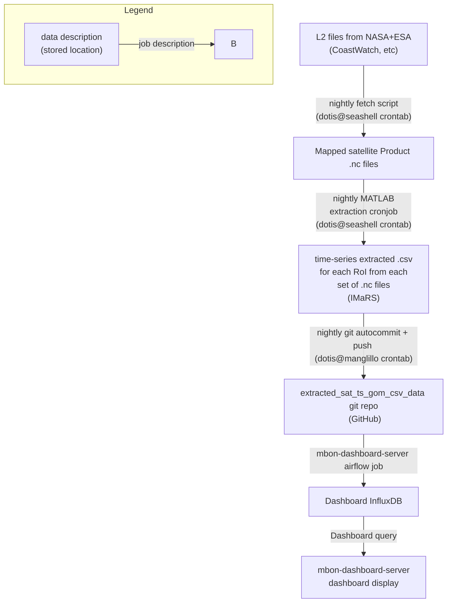

# extracted_sat_ts_gom_csv_data

* dan has nightly routine to extract locations 
  * orchestrated by cron
  * runs matlab scripts
* a different cron job calls upload_files.sh to upload the csv files here
* once into github
  * can be pulled into quarto directly
  * can be pulled into grafana via modified airflow job
    * TODO: replace `imars.usf.edu/public_html/...` with `raw.github.com/...` in curl command  

### data-flow diagram:

